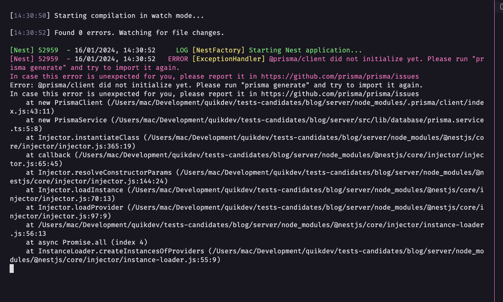
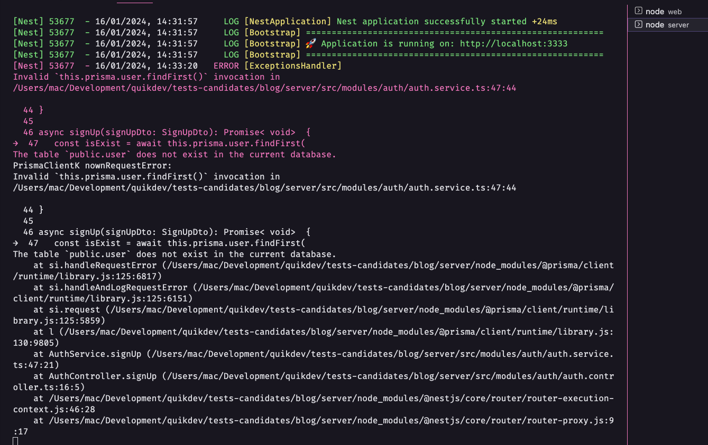
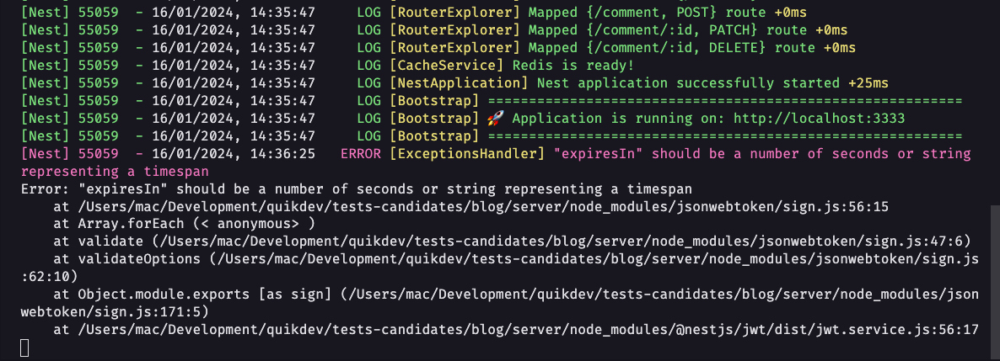
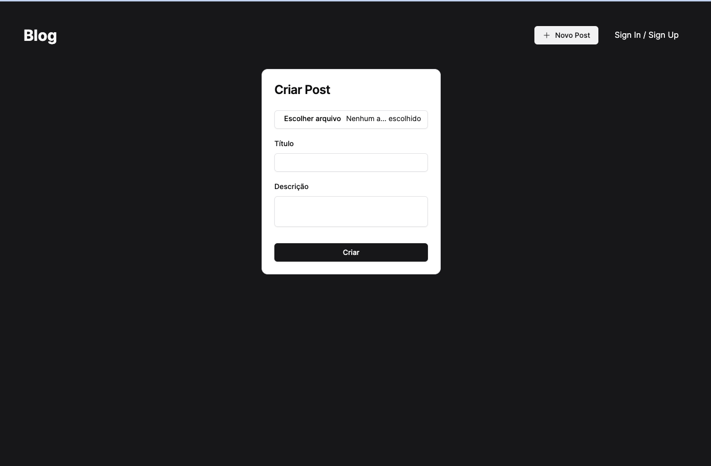
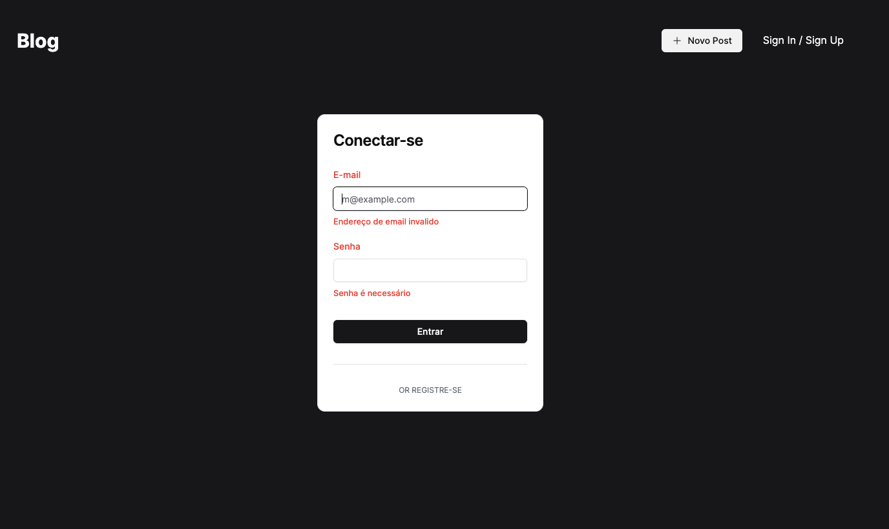
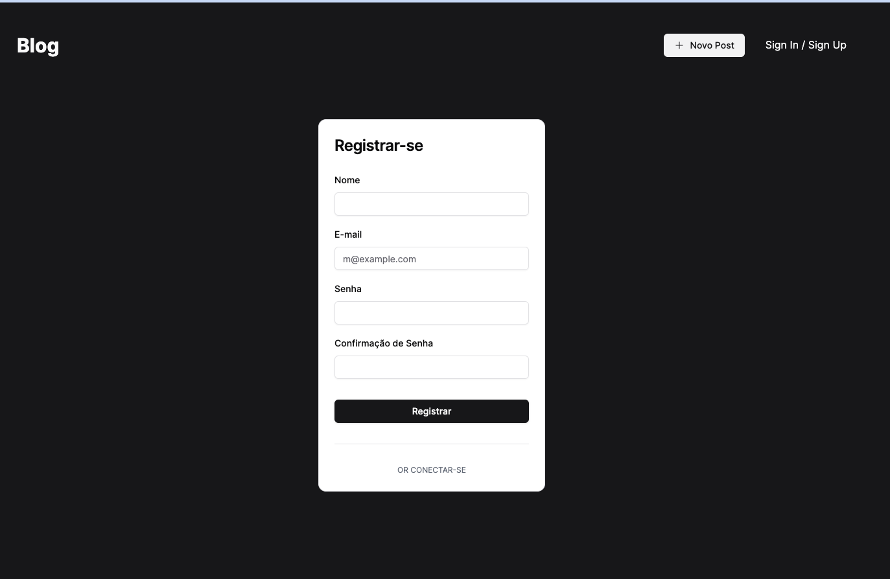
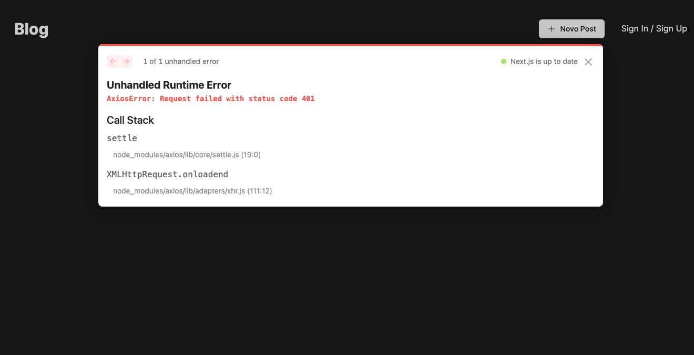

## Start do projeto
- Segui exatamente as instruções descritas no `Readme.md` e consegui executar o projeto com alguns problemas no backend, porém no frontend não encontrei erros para inicializar;

- ### Pontos de melhoria:
  - Ao startar o projeto, como esta sendo utilizado prisma, ocorre alguns erros devido a não rodar o start do prisma:
    - 
    - 
  - Quando tentei fazer o login após o cadastro, apareceu um erro de preenchimento de variável no `.env`:
    - 

## Comentários Frontend
  - Foi feito um post com upload da imagem, e adicionado comentários com imagem também até o nível 3 (está sendo permitido adicionar comentários no post com o mesmo usuário logado, independe do nível), sem nenhum erro e todos contabilizados e mostrados corretamente;
  - Layout:
  - 
  - 
  - 
  
  ### Pontos de melhoria
  - Ao entrar na home, o botão para criar post está aparecendo, mesmo sem ter feito login, e quando tentei criar apareceu um erro:
    - 
  - Não encontrei a tela para mostrar o relatório com resumos dos posts e comentários;

## Comentários Backend
  - Projeto esta bem estruturado, seguindo a maioria dos padrões do framework `Nestjs` e `SOLID`;
  - Utilizado ORM `Prisma` para iterações com o banco de dados, e banco `postgres`;
  - Foi implementado `cache` na aplicação;
  - Gostei bastante da separação por domínios respeitando as camadas de responsabilidade para cada `module` criado;

### Pontos de melhoria
  - Não foram feitos testes para o projeto;
  - Melhor estruturação das `envs`, acrescentando informações do `JWT`;