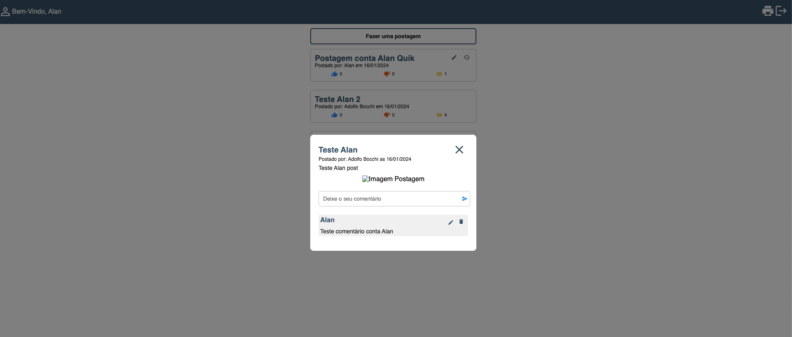

## Start do projeto
- Segui exatamente as instruções descritas no `Readme.md` e consegui executar o projeto sem problemas, backend e frontend;
- Utilizado banco SQLite, muito prático para rodar e testar o projeto;

## Comentários Frontend
  - Foi feito um post com upload da imagem, e adicionado comentários (está sendo permitido adicionar comentários no post com o mesmo usuário logado) com imagem, porém com um erro. Números de likes, dislikes e views contabilizando;
  - Layout:
  - 
  - 
  - 
  - 
  
  ### Pontos de melhoria
  - Quando inserido um comentário em um post, independente do autor, todos os comentários dos outros posts são alterados:
    - 
  - Ao inserir um comentário, ocorre um erro no backend:
    - 
  - Likes e dislikes somam valores ao clicar, sem aplicar nenhuma regra para validação;

## Comentários Backend
  - Tests executados:
    - 
  - Projeto codado utilizando `javascript`;
  - Status code das respostas e tratamentos de erros coerentes com os resultados;

### Pontos de melhoria
  - As regras de negócio estão todas dentro da `model`, talvez seria mais interessante desacoplar um pouco as funcionalidades;
  - Documentação das rotas do projeto, podendo ser um `postman` ou `swagger` pra conseguir testar as rotas de modo individual e analisar os parâmetros;
  - Está ocorrendo um erro na lib `moment` ao inserir comentários, não consegui testar completamente os níveis de comentários;