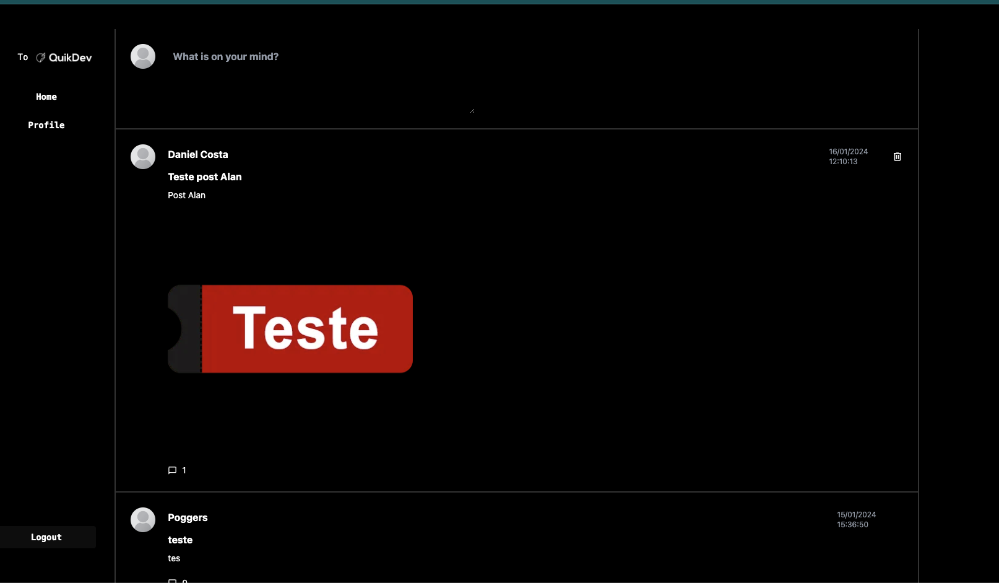
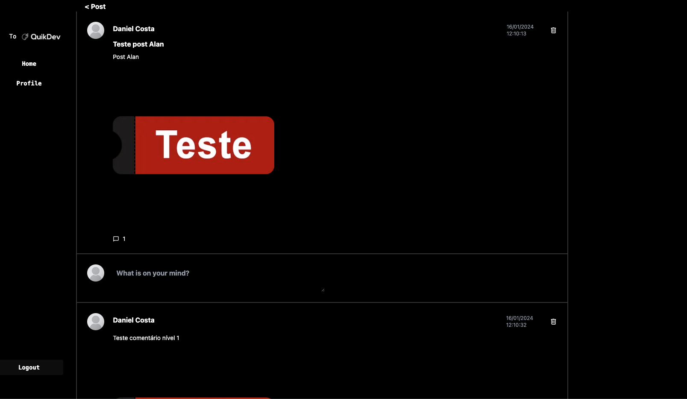
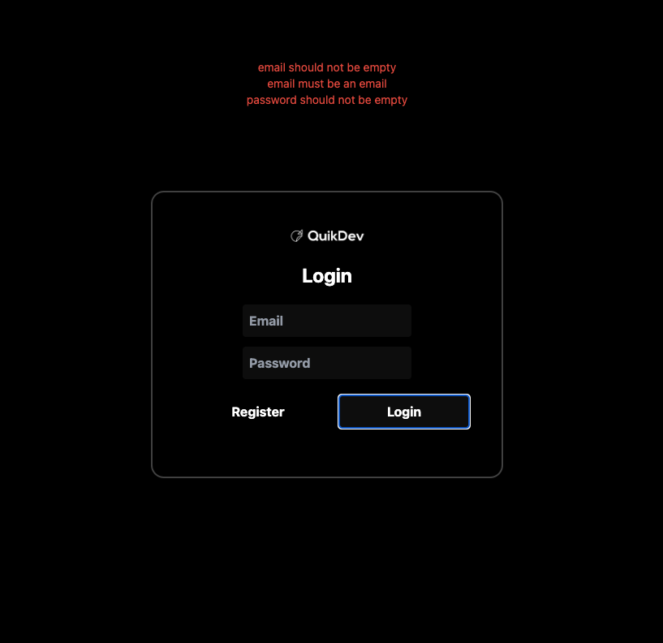
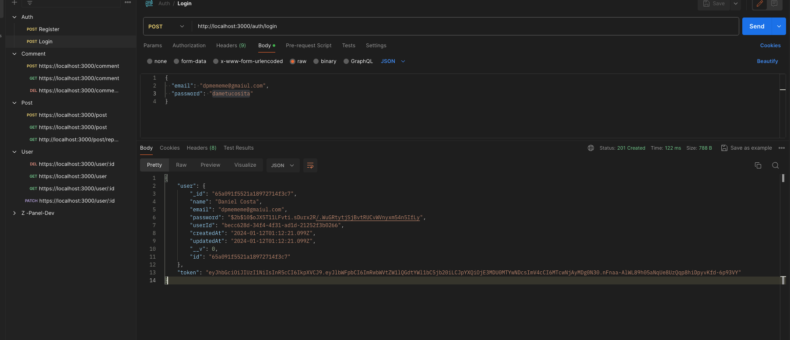

## Start do projeto
- Gostei bastante da facilidade ao rodar o projeto com o comando `task` (shell), instalando as dependências, rodando frontend e abrindo o browser e rodando o backend. Segui as instruções conforme documento e consegui rodar com sucesso a aplicação;

- ### Pontos de melhoria:
  - O start via comando ocorre utilizando o `vscode`, utilizado pela maioria dos devs hoje, porém acho interessante uma descrição mais detalhada sobre a instalação, caso o usuário opte por não usar o editor;
  - Como o projeto sobe de forma automática, talvez implementar um banco de dados SQLite para testar local ou um container com o banco de dados local facilitaria muito e evitaria erros ao validar, não tive problemas com o banco hospedado, porém esta em uma conta pessoal, com essa implementação poderia ocorrer a criação das `envs` automáticas de exemplo sem risco de expor as de produção;

## Comentários Frontend
  - Foi feito um post com upload da imagem, e adicionado comentários com imagem também até o nível 3 (está sendo permitido adicionar comentários no post com o mesmo usuário logado, independe do nível), sem nenhum erro e todos contabilizados e mostrados corretamente;
  - Layout:
  - 
  - 
  - 
  
  ### Pontos de melhoria
  - Não encontrei a tela para mostrar o relatório com resumos dos posts e comentários;
  - Ao fazer o login com a conta do postman, entra no perfil do Daniel, porém quando clico em `Home`, acredito que por conta do roteamento de portas na primeira execução, aparece um erro, porém quando executei novamente `npm run start`, abriu na porta `3002` e não ocorreu mais:
  ```js
  { 
    "message": "Cannot GET /",
    "error": "Not Found",
    "statusCode": 404
  }
  ```

## Comentários Backend
  - Projeto esta bem estruturado, seguindo a maioria dos padrões do framework `Nestjs` e `SOLID`;
  - Gostei bastante da estruturação dos schemas (tratamentos e validações), models e entidades do `mongoose`, assim também a facilitação da exportação da feature, simplificando os imports futuros; 
  - Gostei bastante da separação por domínios respeitando as camadas de responsabilidade para cada `module` criado;
  - Os testes para importar as rotas via `postman` deram certo;

### Pontos de melhoria
  - Os testes criados no projeto são padrões para verificação de instâncias, não estão sendo verificadas as funcionalidades, quando rodei o comando `npm run test` e `npm run test:e2e` para verificação todos os testes falharam;
  - Melhor estruturação das `envs`, acrescentando informações de seleção de porta e informações do `JWT`, como tempo de expiração. Melhor ainda se vier acompanhado de validações antes da utilização;
  - Endpoint de login está retornando informações pessoais como `password` e algumas que não são necessárias para o mesmo;
  - 
  - Alguns `status code` retornados não correspondem com o erro gerado, como por exemplo, retorno do e-mail existente retorna `400`;