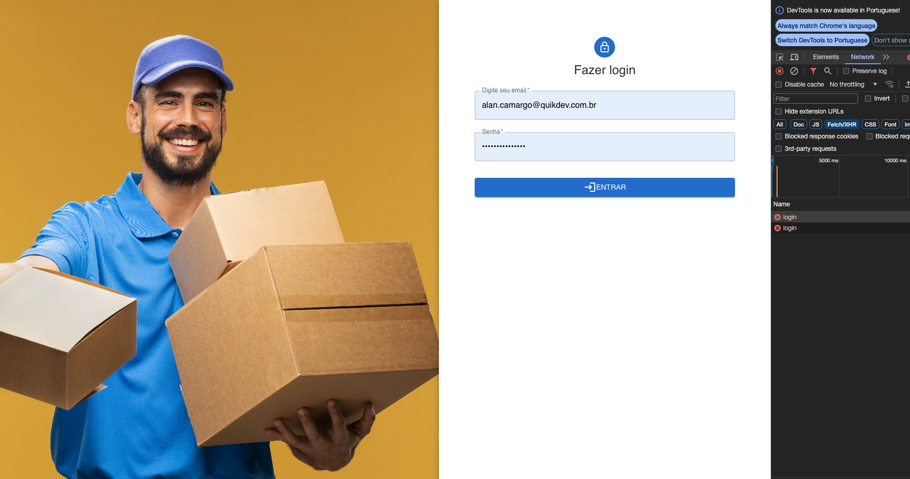
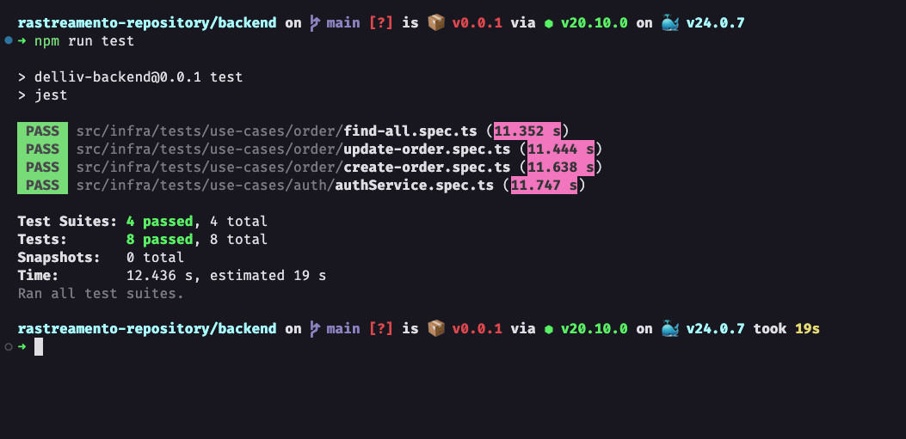

## Start do projeto
- Segui exatamente as instruções descritas no `Readme.md` e consegui executar o projeto com alguns problemas, backend e frontend;
- Todas as informações necessárias para o start estão descritas no documento, porém se seguir na ordem não da certo, seria necessário reorganizer e melhor descrever os passos;

## Comentários Frontend
  - Entrei na aplicação e me deparei com a tela de login sem nenhum erro;
  - Layout:
  - 
  - A estrutura do projeto está muito bem organizado, `atoms`, `molecules`, `templates`, `contexts`.
  
  ### Pontos de melhoria
  - Não encontrei a tela para cadastrar um usuário e não encontrei um login para testar o dashboard;
  - Não foram feitos testes no frontend;

## Comentários Backend
  - Tests executados:
    - 
  - Projeto muito bem estruturado, utilizando padrões do framework `Nestjs` e `SOLID`;
  - Separado as regras de negócio e responsabilidades dos useCases;
  - Status code das respostas e tratamentos de erros coerentes com os resultados;

### Pontos de melhoria
  - Documentação das rotas do projeto, podendo ser um `postman` ou `swagger` pra conseguir testar as rotas de modo individual e analisar os parâmetros;
  - Não consegui executar testes manuais devido a não documentação dos endpoints, preciso criar um user pra testar no frontend;